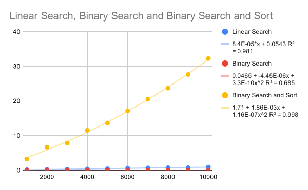

# Algorithms

## Sorting

### Computational Analysis

The bubble sort algorithm has an worst case time complexity of `O(n^2)`, since it has 2 nested for loops that go through the entire array. In this example, the algorithm has been slightly optimized, as it only loops through the unsorted part of the array, which does improve performance a bit, but the algorithm still behaves like an `O(n^2)` algo in the worst case.

The insertion sort algorithm also has a worst case time complexity of `O(n^2)`, since it also has two nested loops that traverse the entire array. It is faster than bubble sort, since it only performs j+1 copies instead of 3\*j copies each loop, but since time complexity drops the coefficient of the number of operations, it is still classified as an `O(n^2)` algo.

Selection sort is similar to insertion sort, but instead does more comparisons instead of swaps. It only does as many swaps as there are items in the array, but has to perform `n^2` comparisons. Thus, dropping the less significant terms and coefficients, it also ends up as an `O(n^2)` algo.

Javascript's built-in sorting function, [at least running on the v8 engine](https://v8.dev/blog/array-sort), uses Timsort, a hybrid of merge sort and insertion sort. It has a worst-case performance of `O(n log n)`, best-case performance of `O(n)`, and average performance of `O(n log n)`, according to [Wikipedia](https://en.wikipedia.org/wiki/Timsort) (which then cites the Python mailing list).

#### Data

Each entry is an average of 10 runs

| Number of Objects | Bubble Sort | Insertion Sort | Selection Sort | Built-in Sort |
| ----------------- | ----------- | -------------- | -------------- | ------------- |
| 1000              | 110.9338655 | 21.74743159    | 45.67461513    | 2.51229394    |
| 2000              | 403.2770572 | 83.58683392    | 171.6920715    | 4.82962935    |
| 3000              | 910.2363267 | 193.7222875    | 392.2523745    | 7.95494459    |
| 4000              | 1626.632564 | 351.0059769    | 702.9222584    | 11.16753266   |
| 5000              | 2567.612992 | 548.6519923    | 1116.986458    | 13.99012056   |
| 6000              | 3833.887149 | 860.5493343    | 1635.57265     | 16.8849648    |
| 7000              | 5261.709881 | 1124.275305    | 2250.333122    | 19.9661986    |
| 8000              | 7043.394565 | 1543.833272    | 2987.25567     | 23.9343923    |
| 9000              | 9547.771962 | 2271.685199    | 4031.247288    | 28.1181272    |
| 10000             | 11946.08544 | 2572.172086    | 5050.478671    | 31.695652     |

We can use regression analysis to create an equation for the data points collected

| Sort Type      | Equation                          | `R^2` |
| -------------- | --------------------------------- | ----- |
| Bubble Sort    | `381 + -0.291x + 1.44E-04x^2`     | 0.999 |
| Insertion Sort | `74.9 + -0.0643x + 3.21E-05x^2`   | 0.994 |
| Selection Sort | `143 + -0.109x + 5.96E-05x^2`     | 0.999 |
| Built-in Sort  | `0.139 + 2.31E-03x + 8.47E-08x^2` | 0.999 |

Bubble Sort, Insertion Sort, and Selection Sort are all expected to be `O(n^2)` sorts, and given the relatively large coefficient of the x^2 term, that seems to be the case. On the other hand, the Built-in Sort is supposed to be an `O(n log(n))` sort, which we can see by the much smaller coefficient our polynomial regression.

### Video

- The algorithms with thinner bars seem to be more efficient, requiring fewer comparisons and array accesses than the simpler `O(n^2)` algorithms
  - There are more thinner bars, thus more items to be sorted
  - Since it takes fewer operations to complete the algos with thinner bars, they are more efficient.
- This video provides an interesting visual representation of some of the more advanced sorting algorithms in computer science. While it doesn't fully explain how these algorithms are built, it showcases some of the innate beauty and complexity of some of these well-designed algos.
  - For some of the more intuitive algorithms, it may also provide a bit of an intuitive understanding of how the algorithm works (eg, how quick sort sorts the array into groups before ordering the items within each group)
- The number of bars or delay time may be changed to skew how efficient the algorithm is in practice. For example, the `O(n^2)` algorithms had fewer bars and a shorter delay, making it seem almost as fast as some of the more efficient algorithms.

## Searching

### Computational Analysis

Linear search algorithm has a worst case time complexity of `O(n)`, since it needs to check each item of the array. Binary search on a sorted array has a worst case time complexity of `O(log n)`, since it only needs to do about `log_2 n` operations. Eg on an array of 100 numbers, binary search needs to perform at most 7 comparisons (to find an item at index 0, it checks index 49, 24, 12, 6, 3, 1, and 0)

### Data

Each entry is an average of 100 runs

| Number of Objects | Linear Search | Binary Search | Binary Search and Sort |
| ----------------- | ------------- | ------------- | ---------------------- |
| 1000              | 0.13818536    | 0.04108114    | 3.2237308              |
| 2000              | 0.23225085    | 0.04353782    | 6.67891996             |
| 3000              | 0.30174814    | 0.0313036     | 7.82005807             |
| 4000              | 0.36919435    | 0.03552712    | 11.53928515            |
| 5000              | 0.43438674    | 0.03142332    | 13.66406135            |
| 6000              | 0.61275474    | 0.03192882    | 17.14911154            |
| 7000              | 0.67519137    | 0.03199154    | 20.50356449            |
| 8000              | 0.74080656    | 0.03309473    | 23.7122747             |
| 9000              | 0.74229234    | 0.03246983    | 27.65348602            |
| 10000             | 0.91542862    | 0.03481905    | 32.27381234            |

Again, we can use regression analysis to create equations for each of the searches

| Search Type            | Equation                           | `R^2` |
| ---------------------- | ---------------------------------- | ----- |
| Linear Search          | `8.4E-05*x + 0.0543`               | 0.981 |
| Binary Search          | `0.0465 + -4.45E-06x + 3.3E-10x^2` | 0.685 |
| Binary Search and Sort | `1.71 + 1.86E-03x + 1.16E-07x^2`   | 0.998 |

Linear search has a relatively high `R^2` value, indicating that the data fits the equation relatively well. Binary search is a lot faster, but that also decreases the precision of our measurements: any fluctuations in computing speed or the random test data generation will sway the speed of the algorithm. The low `R^2` value means that we can't make any conclusions about whether it fits a polynomial equation. However, the fact that binary search is significantly faster than linear search suggests that is faster than `O(n)` time, matching our analysis of `O(log n)` time. However, if the sorting time is taken into account, binary search takes much longer than linear search. This is because even a highly optimized sorting algorithm will take longer than `O(n)` time (Timsort takes `O(n log n)` on average, which is still much more than `O(n)`).

## Recursion

The most common pitfall of recursion is infinite recursion. This happens when the base case is improperly defined, or the modifications that the other recursion cases make cause the base case to never be reached. For example, one mistake I made when programming the digit sum recursive function was passing the entire string back into the function, instead of the substring not including the last digit. That caused an infinite recursion error, which I then fixed after noticing the incorrect parameters I passed to `.slice`. Another pitfall is that recursion overhead tends to be higher than iteration, since a function call is much more costly than changing an index. Time complexity also tends to be higher, but the benefit is that in general, recursive code is simpler and more elegant. Other issues I needed to tackle included conceptualizing the recursive function: building a recursive function requires you to break the solution down into smaller pieces (decomposition), which is a different way of thinking than traditional iterative programming. Recursive programs also tend to be harder to think through and debug, since instead of just keeping track of maybe two or three loops, you need to keep track of layers of recursive calls.
